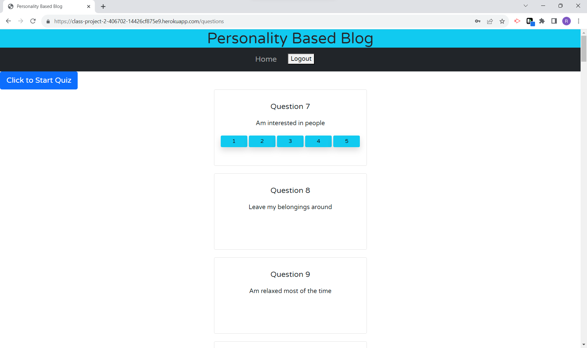
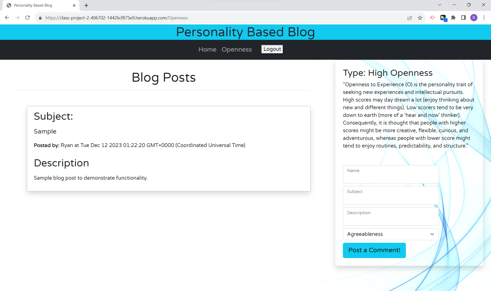

# Project-2
Group 6

## Description
This is the creation of a website dedicated to organizing users into groups with similar personality traits. The goal is to make it easy for anyone to find like minded people to share ideas and enjoy conversations based upon the results of a personmality test.

 * As a Developer I want to create a website where a user can take a personality test and be grouped with other user of similar traits to converse based off of similar interests.The data being stored will be logins for users, the code id attached to the user info based off of the personality test, and comments that users post to each other in their personalized communities.  We are going to use Passport.js for loging in through google/facebook.

## Acceptance Criteria
 * It is done when there is a splash page for the website that has a login.
 * It is done when there is a functional personality quiz for users to take.
 * It is done when there is a result returned for the completed personality quiz.
 * It is done when the user is grouped into a group based upon their specific results from the personality quiz.
 * It is done when the user is able to post and receive messages in the group. 

## Expected Behaivor 
1. Clone the repository to your local terminal.
2. Install any necessary dependencies.
3. Run the application.

## Usage
To use this app, the user needs to either create an account locally or log in through Google. From that point, the app will automatically direct you to a quiz
with 50 questions the user must answer. After submitting their answers, the page will direct the user to their "tribe" of people who scored similarly. The
next page is a standard forum/blog form and a list of different posts made by people to that page. The user can enter a name, subject, as well as a description
and it will post to the feed. When the user is done, they can logout by clicking the logout button at the top of the page.
will post to the feed.

--------------------------------------------------------------------------------------------------------------------
##  Screenshots

## Contributing
If you have ideas for improvements or new features, please open an issue. Contributions to improving this project are welcomed and appreciated!

## Acknowledgement 
Images located in assets were all sourced from https://www.pixabay.com

This project is created for educational purposes.

## Authors

Clifford Rouzeau

Jacob Rahmann Fratti

Ryan Caltabiano 

Ted Fleuriscat

Myles Vaughn 

## Link to Application
[Heroku](https://class-project-2-406702-14426cf875e9.herokuapp.com/)

## License 
MIT 
